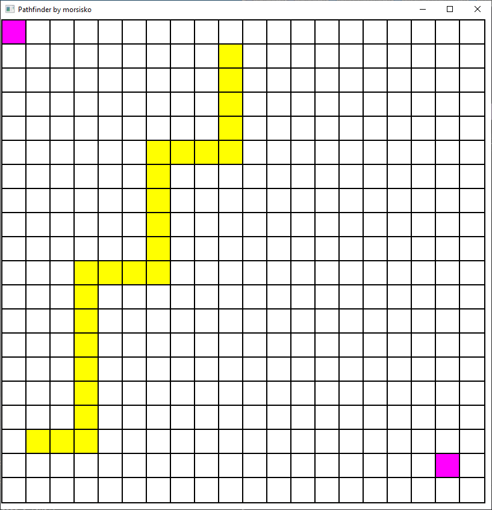

# Interactive-Pathfinder
An interactive program in which you can follow A* or Dijkstra's algorithm step by step on a map grid. Built using C++ and SFML.

# Compilation
Tested on Windows and Linux using SFML 2.5

## Visual Studio
Run the .sln and set proper SFML's include and lib paths in solution settings, then press F5

## Makefile
If your SFML is installed in non-standard path you need to edit the very first lines of Makefile and set correct path to SFML.
Otherwise just type `make` in your shell.

# Usage
Use `left mouse` button to put an obstacle on the map.

Use `right mouse` button to remove an obstacle from a map.

Use `spacebar` key to immediately find a route from start node to end node.

Use `right arrow` key to move one step ahead.

Edit `config.ini` file in order to change some crucial parameters.

# Colors
`Violet` - staring and ending point (the route will be calculated between those two points)

`White` - unvisited, empty node

`Yellow` - obstacle, can't be visited during path calculation

`Red` - a node that is already in the closed list, cannot be visited anymore

`Green` - a node that is already on the open list, can be visited

`Dark blue` - a node that is part of the shortest path calculated by the algorithm

# Algorithm selection
In order to use:
* `A star` algorithm - set `algorithm` property to 0 inside `config.ini`
* `Dijkstra` algorithm - set `algorithm` property to 1 inside `config.ini`

# Presentation

# Download
Built binaries for MS Windows: https://github.com/morsisko/Interactive-Pathfinder/releases/
